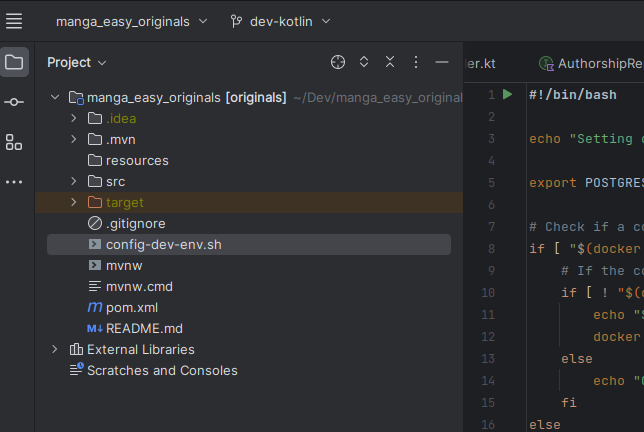

# manga_easy_originals
api manga

To run this project you need to have:

`Maven`
`Java 17`
`Docker`

After installing docker just run the config dev environment script.

After that just import the project to Intelij and start it.
